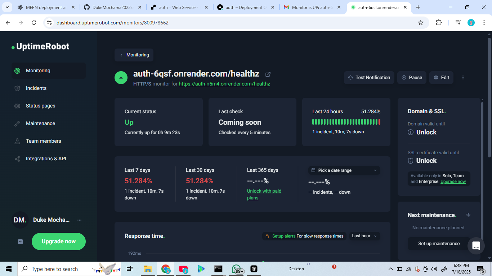

# MERN Auth App – Deployment & DevOps

## 🚀 Overview

This is a full-stack MERN authentication app, deployed with CI/CD, environment variable management, and monitoring.  
It demonstrates best practices for production readiness, automated deployment, and maintenance.

---

## 🌐 Live URLs

- **Frontend:** [https://your-frontend-url.vercel.app](https://auth-git-main-projects-projects-17ce6fbc.vercel.app/)
- **Backend API:** [https://auth-6qsf.onrender.com](https://auth-n5m4.onrender.com)

---

## 📦 Repository Structure

```
/backend    # Express.js API
/frontend   # React + Vite frontend
.github/    # GitHub Actions workflows
```

---

## ⚙️ Environment Variables

### Backend (`backend/.env.example`)

```
MONGO_URI=your_mongodb_connection_string
PORT=5000
JWT_SECRET=your_secret
```

### Frontend (`frontend/.env.example`)

```
VITE_API_URL=https://auth-6qsf.onrender.com
```

---

## 🚀 Deployment Instructions

### **Backend (Render)**

1. Create a new Web Service on [Render](https://render.com/).
2. Connect your GitHub repo and select the backend folder.
3. Set environment variables from `.env.example`.
4. Use the provided deploy hook for CI/CD (see `.github/workflows/backend.yml`).

### **Frontend (Vercel)**

1. Import your repo on [Vercel](https://vercel.com/).
2. Set the root directory to `/frontend`.
3. Set environment variables from `.env.example`.
4. Vercel auto-deploys on every push to `main`.

---

## 🔄 CI/CD

- **GitHub Actions** run lint, test, and build for both frontend and backend.
- **Backend:** Deploys to Render via deploy hook on successful build.
- **Frontend:** Vercel auto-deploys on push to `main`.

---

## 🖼️ CI/CD Pipeline Screenshots


_GitHub Actions: Example of a successful CI/CD pipeline run_


_Vercel frontend deployment logs_


_Render backend deployment logs_

---

## 📈 Monitoring & Maintenance


_Example monitoring dashboard (e.g., UptimeRobot or Render/Vercel analytics)_

### Health Check Endpoint

- `/healthz` on backend returns `{ "status": "ok" }`.

### Uptime Monitoring

- [UptimeRobot](https://uptimerobot.com/) monitors the `/healthz` endpoint.

### Performance Monitoring

- Render and Vercel dashboards provide resource and performance metrics.

### Maintenance Plan

- Regular dependency updates (`npm outdated`).
- MongoDB Atlas automated backups.
- Rollback via Render/Vercel dashboards.

---

## 📝 Maintenance & Rollback Procedures

- To update dependencies:
  ```
  cd backend && npm update
  cd frontend && npm update
  ```
- To rollback:  
  Use the Render or Vercel dashboard to revert to a previous deployment.

---

## 📚 Additional Notes

- For local development, copy `.env.example` to `.env` in both `backend` and `frontend` and fill in your secrets.
- For staging, use a separate branch and environment variables.
